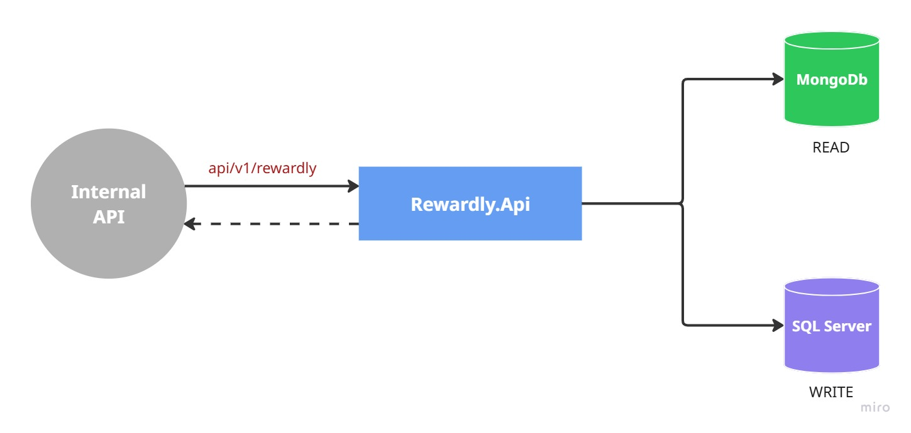
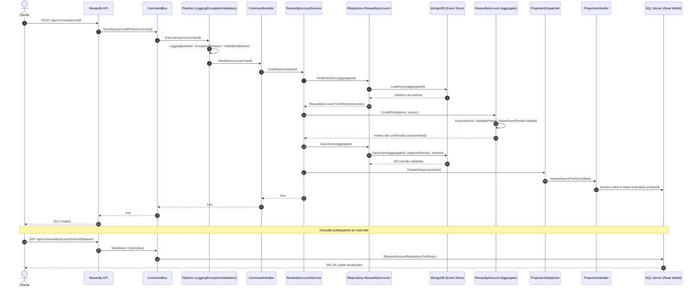

# Rewardly — Event Sourcing (C#)

  

- [Rewardly — Event Sourcing (C#)](#rewardly--event-sourcing-c)
  - [**Visão Geral**](#visão-geral)
  - [**Intenção de Negócio**](#intenção-de-negócio)
  - [**Estado Atual do Projeto**](#estado-atual-do-projeto)
  - [**Domínio**](#domínio)
    - [Aggregate Root](#aggregate-root)
    - [Regras de negócio modeladas](#regras-de-negócio-modeladas)
    - [Eventos de domínio](#eventos-de-domínio)
  - [**Arquitetura**](#arquitetura)
    - [Write Side](#write-side)
    - [Read Side](#read-side)
    - [Pipeline de execução (Command/Query Bus)](#pipeline-de-execução-commandquery-bus)
  - [**API (v1)**](#api-v1)
    - [Comandos](#comandos)
    - [Consultas](#consultas)
  - [**Fluxo Completo (Command → Evento → Projeção)**](#fluxo-completo-command--evento--projeção)
    - [Diagrama de sequência](#diagrama-de-sequência)
  - [**Stack Tecnológica**](#stack-tecnológica)
  - [**Como Executar Localmente**](#como-executar-localmente)
    - [Pré-requisitos](#pré-requisitos)
    - [Configuração](#configuração)
    - [Comandos](#comandos-1)
  - [**Próximos Passos**](#próximos-passos)
  - [**Observações**](#observações)
  - [**Licença**](#licença)

## **Visão Geral**

Rewardly é um projeto backend de estudo que simula um programa de fidelidade de companhia aérea, aplicando **Event Sourcing** e **CQRS** em um contexto de negócio simples: criação de contas, acúmulo e consumo de pontos, e resgate de recompensas, com trilha completa e auditável de eventos.

## **Intenção de Negócio**

Em programas de fidelidade, a confiança no saldo de pontos e no histórico de movimentações é essencial — qualquer divergência afeta diretamente a experiência do cliente e a credibilidade do programa.

Este projeto modela esse problema com foco em:

- **rastreabilidade** total das mudanças de estado de uma conta, através dos eventos de domínio persistidos;
- **consistência** das regras de negócio centralizadas no agregado (`RewardlyAccount`);
- **separação clara** entre o processamento de comandos (write side, orientado a eventos) e as consultas (read side, otimizado para leitura).

## **Estado Atual do Projeto**

Status de referência: 2026-09-06.

| Item | Estado Atual |
| --- | --- |
| Build da solução | Concluído com sucesso, sem warnings (`dotnet build`) |
| Write Side (comandos, domínio e event store) | Implementado |
| Read Side (projeções e consultas) | Implementado |
| Pipeline de execução (logging, validação e tratamento de exceções) | Implementado |
| Testes automatizados | Projetos de teste criados (`Rewardly.UnitTests`, `Rewardly.IntegrationTests`), sem casos implementados |
| Observabilidade (métricas/tracing) | Planejado |
| CI/CD | Planejado |

O core de Event Sourcing (write side) e o modelo de leitura materializado (read side) já estão funcionais ponta a ponta. O foco atual é consolidar a cobertura de testes e evoluir observabilidade e automação de entrega.

## **Domínio**

### Aggregate Root

`RewardlyAccount` — representa a conta de recompensa de um usuário.

Objetos de valor e enums relevantes:

- `Balance` — saldo de pontos da conta;
- `AccountStatus` — status da conta (`Active`, `Blocked`, `Cancelled`).

### Regras de negócio modeladas

- somente contas ativas podem sofrer crédito, débito, resgate e expiração de pontos;
- pontos movimentados devem ser maiores que zero;
- débito e resgate exigem saldo suficiente;
- cancelamento não é permitido com saldo positivo;
- bloqueio/cancelamento repetidos não geram novo evento (idempotência no agregado).

### Eventos de domínio

- `AccountCreated`
- `AccountBlocked`
- `AccountCancelled`
- `PointsCredited`
- `PointsDebited`
- `PointsExpired`
- `RewardRedeemed`

## **Arquitetura**



### Write Side

- API HTTP recebe o comando e o encaminha ao `CommandBus`.
- O `CommandBus` executa o comando através do `PipelineExecutor`, aplicando os *behaviors* de logging, validação e tratamento de exceções antes de invocar o handler.
- O handler do comando delega a regra de negócio ao `RewardlyAccountService`, que carrega o agregado a partir do histórico de eventos (`IRepository<RewardlyAccount>`), aplica a mudança de estado e persiste os novos eventos no **MongoDB** através do `MongoEventStore` (com checagem de versão esperada para concorrência otimista).
- Após a persistência, os eventos gerados são publicados ao `ProjectionDispatcher`, que aciona os `IProjectionHandler<TEvent>` responsáveis por atualizar o modelo de leitura.

### Read Side

- Projeções materializam o estado da conta e o histórico de transações em **SQL Server**, através de `IRewardAccountRepository` e `IRewardTransactionRepository`.
- Consultas HTTP (`GetAccount`, `GetBalance`, `GetTransactions`) são processadas pelo `QueryBus`, que utiliza o mesmo pipeline de execução do write side (sem a etapa de persistência de eventos).

### Pipeline de execução (Command/Query Bus)

Todo comando e toda consulta passam pelo mesmo pipeline de *behaviors*, executados na seguinte ordem:

1. `LoggingBehavior` — registra início e fim da execução da requisição.
2. `ExceptionBehavior` — captura e padroniza exceções não tratadas.
3. `ValidationBehavior` — valida a requisição antes de chegar ao handler.

## **API (v1)**

Base route: `/api/v1/rewardly`

### Comandos

| Endpoint | Objetivo | Payload |
| --- | --- | --- |
| `POST /account` | Criar conta de recompensa | `{ "userId": "guid" }` |
| `POST /block` | Bloquear conta | `{ "aggregateId": "guid", "reason": "string" }` |
| `POST /cancel` | Cancelar conta | `{ "aggregateId": "guid", "reason": "string" }` |
| `POST /credit` | Creditar pontos | `{ "aggregateId": "guid", "points": 100, "reason": "string" }` |
| `POST /debit` | Debitar pontos | `{ "aggregateId": "guid", "points": 100, "reason": "string" }` |
| `POST /redeem` | Resgatar recompensa | `{ "aggregateId": "guid", "rewardId": "guid", "points": 100 }` |

### Consultas

| Endpoint | Objetivo | Parâmetros |
| --- | --- | --- |
| `GET /account/{userId}` | Obter dados da conta | `userId` (rota) |
| `GET /account/{userId}/balance` | Obter saldo atual da conta | `userId` (rota) |
| `GET /account/{userId}/transactions` | Obter histórico de transações (paginado) | `userId` (rota), `page`, `pageSize` (query) |

Resposta padrão: envelope `ResponseBase<T>`.

## **Fluxo Completo (Command → Evento → Projeção)**

O diagrama abaixo ilustra o ciclo de vida de um comando de escrita (ex.: criar/creditar/debitar pontos), desde a chamada HTTP até a atualização do modelo de leitura, seguida de uma consulta ao read side.

### Diagrama de sequência

<div style="width: 100%;">



</div>

## **Stack Tecnológica**

- .NET 8
- ASP.NET Core Web API
- MongoDB (Event Store — write side)
- SQL Server (Read Model — read side)
- xUnit (estrutura de testes)
- Dockerfile para conteinerização da API

## **Como Executar Localmente**

### Pré-requisitos

- .NET SDK 8
- MongoDB disponível localmente ou remoto
- SQL Server disponível localmente ou remoto

### Configuração

1. Ajuste `MongoDbSettings:ConnectionString` em [src/Rewardly.Api/appsettings.Development.json](src/Rewardly.Api/appsettings.Development.json).
2. Ajuste `ConnectionStrings:SqlServer` no mesmo arquivo.
3. Opcionalmente ajuste `MongoDbSettings:DatabaseName` e `MongoDbSettings:CollectionName` conforme o ambiente.

### Comandos

```bash
dotnet build .\Personal.EventSourcing.Rewardly.slnx
dotnet run --project .\src\Rewardly.Api\Rewardly.Api.csproj
```

A API expõe Swagger em ambiente de desenvolvimento (`/swagger`) e health check em `/health`.

## **Próximos Passos**

- implementar casos de teste unitários para o agregado `RewardlyAccount` e para os *behaviors* do pipeline;
- implementar testes de integração para o fluxo completo (comando → evento → projeção → consulta);
- incluir idempotência de comandos na entrada da API;
- adicionar observabilidade operacional (métricas, tracing distribuído);
- estruturar pipeline de CI/CD.

## **Observações**

- o sistema não armazena dados pessoais sensíveis (nome, CPF etc.);
- o identificador de usuário é tratado como `UserId` externo;
- o foco do repositório é arquitetura backend e evolução técnica.

## **Licença**

Projeto para fins educacionais.
